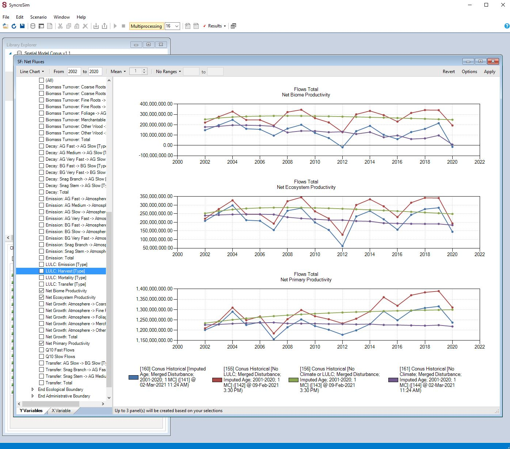
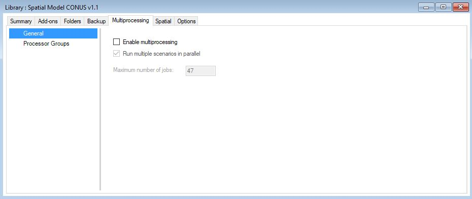
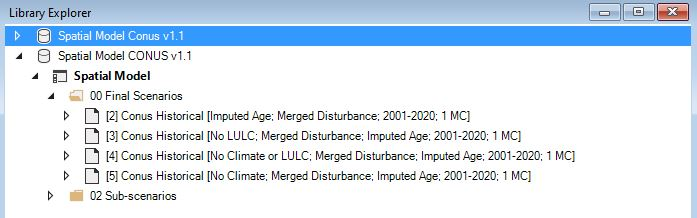
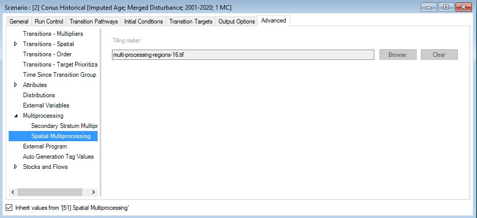

<!-- PROJECT LOGO -->
<br />
<div align="center">

<h3 align="center">LUCAS Model of Land Use Change and Ecosystem Carbon Dynamics</h3>

  <a href="https://github.com/bsleeter/lucas-national-assessment">
    
  </a>
  
  <p align="center">
    LUCAS Land Use and Carbon Modeling
  </p>

</div>


<!-- TABLE OF CONTENTS -->
<details>
  <summary>Table of Contents</summary>
  <ol>
    <li>
      <a href="#about-the-project">About The Project</a>
      <ul>
        <li><a href="#software-and-applications">Software and Applications</a></li>
      </ul>
    </li>
    <li>
      <a href="#getting-started">Getting Started</a>
      <ul>
        <li><a href="#prerequisites">Prerequisites</a></li>
        <li><a href="#installation">Installation</a></li>
      </ul>
    </li>
    <li><a href="#usage">Usage</a></li>
    <ul>
        <li><a href="#run-base-simulations">Run base simulations</a></li>
      </ul>
      <ul>
        <li><a href="#running-smaller-regions">Running smaller regions</a></li>
      </ul>
    <li><a href="#contact">Contact</a></li>
    <li><a href="#resources">Resources</a></li>
  </ol>
</details>


<!-- ABOUT THE PROJECT -->
## About The Project

This repository provides access to the Land Use and Carbon Scenario Simulator model used to estimate recent historical carbon stocks and fluxes in U.S. forests between 2001 and 2020. The modeling approach links the Carbon Budget Model of the Canadian Forest Sector (CBM-CFS3) with the LUCAS model of land use and land cover change to provide annual spatially explicit carbon estimates at 1-km resolution. The repository includes a fully-functioning LUCAS model along with a peer-reviewed manuscript published in Carbon Balance and Management.  

### Model outputs
A set of spatial outputs are available from the U.S. Geological Survey's [ScienceBase data archive](https://www.sciencebase.gov/catalog/item/61aa50dad34eb622f699df78). Annual spatially explicit carbon stock maps are available for a wide range of carbon pools. 

In addition to spatial output, a set of tabular output summaries are also available.

For questions about data availability please contact bsleeter@usgs.gov.

<p align="right">(<a href="#top">back to top</a>)</p>


### Software and applications

The following applications where used in the development of the model. To run the model, users only need to download the SyncroSim application and the model library from this repository.

* [SyncroSim](https://syncrosim.com/)
* [CBM-CFS3](https://www.nrcan.gc.ca/climate-change/impacts-adaptations/climate-change-impacts-forests/carbon-accounting/carbon-budget-model/13107)
* [R](https://cran.r-project.org/)
* [R Studio](https://www.rstudio.com/)

<p align="right">(<a href="#top">back to top</a>)</p>


<!-- GETTING STARTED -->
## Getting Started

To get a local copy of the LUCAS model up and running follow these simple steps.

### Prerequisites

* Download and install a local version of the [SyncroSim software application](https://syncrosim.com/download/). SyncroSim runs on most Windows operating systems. For detailed instructions on installing SyncroSim see [this link](http://docs.syncrosim.com/getting_started/inst_win.html). For MacOS users, see [these instructions](http://docs.syncrosim.com/getting_started/inst_lin.html).

* Optionally, install the [rSyncroSim package](https://syncrosim.com/r-package/) from [CRAN](https://cran.r-project.org/package=rsyncrosim).

### Installation

1. Clone the repo
   ```sh
   git clone https://github.com/bsleeter/lucas-national-assessment.git
   ```
<p align="right">(<a href="#top">back to top</a>)</p>


<!-- USAGE EXAMPLES -->
## Usage

The LUCAS model available through this repository has four pre-built scenarios available to the user. Due to size limitations, completed runs are not provided. The first step is to run the pre-built scenarios locally. Note, to running the entire CONUS model can take significant computing resources.

### Run base simulations

1. Open the SyncroSim application installed locally. 
2. Open the "Spatial Model CONUS v1.1.ssim" library which can be found in the cloned repository location.
3. Prior to running scenarios, it is advisable to set up multiprocessing parameters. To do so we navigate to "File>Library Properties" and select the "Multiprocessing" tab from the top. Under the "General" options, click on the "Enable multiprocessing" and "Run multiple scenarios in parallel" check boxes. Select the number of jobs to process at one time. This value should be automatically set to one minus the number of logical cores available on the local computer. Users should adjust this value based on available computing resources. 

  <a href="https://github.com/bsleeter/lucas-national-assessment">
    
  </a>


4. In the Library Explorer, navigate to the folder named "00 Final Scenarios" and select one or more of the pre-built scenarios to run. Right-click on a scenario and select "Run". The scenarios available include:

  * LULC and climate effects: "Conus Historical [Imputed Age; Merged Disturbance; 2001-2020; 1 MC]"
  * Climate effects only: "Conus Historical [No LULC; Merged Disturbance; Imputed Age; 2001-2020; 1 MC]"
  * No effects: "Conus Historical [No Climate or LULC; Merged Disturbance; Imputed Age; 2001-2020; 1 MC]"
  * LULC effects only: "Conus Historical [No Climate; Merged Disturbance; Imputed Age; 2001-2020; 1 MC]"

  <a href="https://github.com/bsleeter/lucas-national-assessment">
    
  </a>* 

### Running smaller regions

Users can select to run smaller regions as opposed to the entire study area. To do so, users must create a "spatial multiprocessing mask" file of the area they want to run. Due to the configuration of the model, at this time only ecoregions, or combinations of ecoregions are supported. Running the model on areas other than ecoregions, or groups of ecoregions will produce erroneous results.

The easiest way to create a new spatial multiprocessing mask is the modify the existing "Primary Strata" raster file. Here is an axample using R and the raster package. 

```{r}
library(raster)
r = raster("local path.../models/conus-v1.1/Spatial Model CONUS v1.1.ssim.input/Scenario-17/stsim_InitialConditionsSpatial/ic-ecoregion.tif")

# Reclassify ecoregion raster to only select the Sierra Nevada Mountains for processing (value = 5)
r_reclass = reclassify(r,
                       0,4,NA,
                       5,5,1,
                       6,Inf,NA)
                       
# Write the new raster to disk.
writeRaster("path to local directory", format="GTiff", datatype="INT2U", overwrite=T)
```

Modify the scenario dependency using the new spatial multiprocessing mask file. 

* Make a copy of the scenario you want to run (either right click to access alt menu or use Edit menu at top).
* Open the scenario you wish to run by double clicking it from the "Library Explorer" menu. 
* Once open, navigate to the "Advanced" tab along the top of the window.
* Click on the "Multiprocessing" caret in the left side panel and select "Spatial Multiprocessing".
* Un-check the check box in the lower left corner of the window which specifies the current raster file being used.
* Once unchecked, replace the "Tiling raster" with the newly created raster.
* Run model.

  <a href="https://github.com/bsleeter/lucas-national-assessment">
    
  </a>* 
  
<p align="right">(<a href="#top">back to top</a>)</p>


<!-- CONTACT -->
## Contact

Benjamin M. Sleeter email@bsleeter@usgs.gov

Project Link: [https://github.com/bsleeter/lucas-national-assessment](https://github.com/bsleeter/lucas-national-assessment)

<p align="right">(<a href="#top">back to top</a>)</p>


<!-- RESOURCES -->
## Resources

* [An overview of SyncroSim and the LUCAS model](http://docs.syncrosim.com/getting_started/overview.html)
* [Apex RMS YouTube Channel](https://www.youtube.com/channel/UC9RBddw2CU0RD4MHPy-EJIQ)
* [LUCAS model application in California](https://onlinelibrary.wiley.com/doi/full/10.1111/gcb.14677)

<p align="right">(<a href="#top">back to top</a>)</p>


<!-- MARKDOWN LINKS & IMAGES -->
<!-- https://www.markdownguide.org/basic-syntax/#reference-style-links -->
[contributors-shield]: https://img.shields.io/github/contributors/github_username/repo_name.svg?style=for-the-badge
[contributors-url]: https://github.com/github_username/repo_name/graphs/contributors
[forks-shield]: https://img.shields.io/github/forks/github_username/repo_name.svg?style=for-the-badge
[forks-url]: https://github.com/github_username/repo_name/network/members
[stars-shield]: https://img.shields.io/github/stars/github_username/repo_name.svg?style=for-the-badge
[stars-url]: https://github.com/github_username/repo_name/stargazers
[issues-shield]: https://img.shields.io/github/issues/github_username/repo_name.svg?style=for-the-badge
[issues-url]: https://github.com/github_username/repo_name/issues
[license-shield]: https://img.shields.io/github/license/github_username/repo_name.svg?style=for-the-badge
[license-url]: https://github.com/github_username/repo_name/blob/master/LICENSE.txt
[linkedin-shield]: https://img.shields.io/badge/-LinkedIn-black.svg?style=for-the-badge&logo=linkedin&colorB=555
[linkedin-url]: https://linkedin.com/in/linkedin_username
[product-screenshot]: images/screenshot.png
